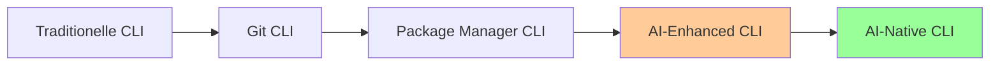

# 🔧 Lektion 1: CLI-Tools & Slash Commands Setup

**Zeit:** 18:00 - 18:50 (50 Minuten)
**Ziel:** Installation und Grundverständnis moderner AI-CLI Tools

## 🎯 **Lernziele**

Nach dieser Lektion können die Teilnehmenden:

- Die wichtigsten AI-CLI Tools benennen und deren Zweck erklären
- Alle essenziellen CLI-Tools erfolgreich installieren
- Erste einfache Commands ausführen
- Den Unterschied zwischen verschiedenen AI-CLI Ansätzen verstehen

## ⏰ **Zeitplan (50 Min)**

### 📚 **Phase 1: Aktivierung & Überblick (10 Min)**

```text
18:00-18:05  Begrüssung & Rückblick RAG-Abend
18:05-18:10  Moderne AI-CLI Landschaft Überblick
```

**Aktivierung Vorwissen:**

- "Was haben wir letzten Abend mit RAG erreicht?"
- "Welche AI-Tools nutzt ihr bereits täglich?"
- "Was würde euch bei der täglichen Entwicklung am meisten helfen?"

**Überblick AI-CLI Evolution:**



### 🚀 **Phase 2: Essential CLI-Tools Installation (25 Min)**

```text
18:10-18:35  Live-Installation aller Tools
```

#### **Voraussetzung: Node.js Installation (2 Min)**

> **ℹ️ Wichtig:** Alle folgenden Tools benötigen Node.js und npm. Falls noch nicht installiert, bitte zuerst herunterladen und installieren.

```bash
# Version prüfen
node --version
npm --version
```

**[Node.js herunterladen](https://nodejs.org/)** (LTS-Version empfohlen)


#### **Tool 1: GitHub Copilot CLI (5 Min)**

```bash
# Installation (GitHub CLI mit Copilot - stabilere Alternative)
# Voraussetzung: GitHub CLI installiert
gh --version

# GitHub CLI authentifizieren
gh auth login

# GitHub Copilot für CLI aktivieren (falls verfügbar)
gh auth refresh -s copilot

# Alternative: Direkt GitHub Copilot in VS Code/Editor nutzen
# Erster Test mit GitHub CLI
gh repo list --limit 3
```

**Pädagogischer Hinweis:** Falls GitHub Copilot CLI Probleme macht, fokussieren wir auf die anderen 3 Tools.

**Troubleshooting:** Bei Authentifizierungsproblemen → GitHub Copilot direkt in VS Code nutzen.

#### **Tool 2: Claude Code CLI (5 Min)**

```bash
# Installation
npm install -g @anthropic-ai/claude-code

# Setup
claude auth login

# Erster Test
claude --version
claude "Hello, can you help me with Python?"
```

#### **Tool 3: Gemini CLI (5 Min)**

```bash
# Installation
npm install -g @google/gemini-cli

# Setup (API Key erforderlich)
gemini config set api-key YOUR_API_KEY

# Erster Test
gemini chat "What is the difference between Python and JavaScript?"
```

#### **Tool 4: Augment Code CLI (5 Min)**

```bash
# Installation
npm install -g @augmentcode/auggie

# Setup
auggie login

# Erster Test
auggie --help
auggie status
```

#### **Troubleshooting & Hilfe (5 Min)**

- Häufige Installationsprobleme lösen
- API-Key Konfiguration überprüfen
- Netzwerk-/Proxy-Probleme beheben

### 🎯 **Phase 3: dotfiles & Slash Commands Einführung (15 Min)**

```text
18:35-18:50  dotfiles Installation + erste Commands
```

#### **dotfiles Repository Setup (8 Min)**
```bash
# Repository klonen
git clone https://github.com/talent-factory/dotfiles.git
cd dotfiles

# Installation
./install.sh

# Claude Commands verfügbar machen
ls ~/.claude/commands/
```

#### **Erste Slash Commands testen (7 Min)**

```bash
# In Claude Code
/commit "Add new feature for user authentication"
/create-pr "Feature: User authentication system"
/help
```

**Live-Demo:** Dozent zeigt Commands in Aktion, Teilnehmende folgen nach.

## 🎓 **Lernzielkontrolle**

### ✅ **Erfolgskriterien**

- [ ] Alle 4 CLI-Tools erfolgreich installiert
- [ ] Mindestens ein Test-Command pro Tool ausgeführt
- [ ] dotfiles Repository geklont und installiert
- [ ] Mindestens 2 Slash Commands getestet

### 🔍 **Schnelle Überprüfung**

```bash
# Alle Tools verfügbar?
gh --version                  # GitHub CLI (als Copilot-Alternative)
claude --version
gemini --version
auggie --version

# Slash Commands verfügbar?
ls ~/.claude/commands/
```

## 💡 **Reflexionsfragen**

1. "Welches Tool hat euch am meisten überrascht?"
2. "Wo seht ihr das grösste Potenzial für euren Arbeitsalltag?"
3. "Welche Herausforderungen sind bei der Installation aufgetreten?"

## 🔗 **Übergang zu Lektion 2**

"Jetzt haben wir alle Tools installiert. In der nächsten Lektion sehen wir sie in Aktion und lernen, wie sie unseren Entwicklungsworkflow revolutionieren können!"

---

**Pause: 18:50 - 19:00 (10 Minuten)**
